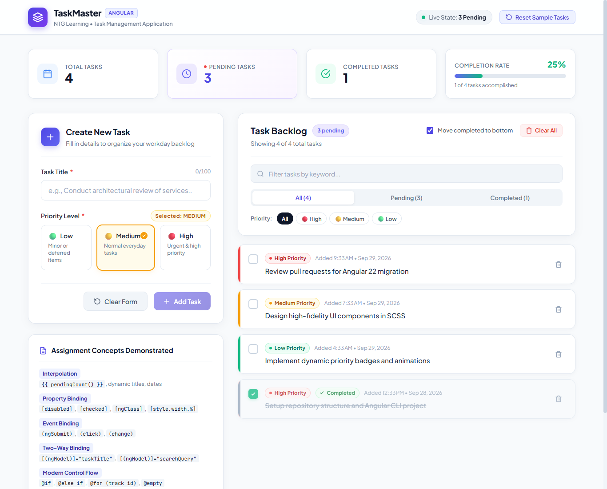
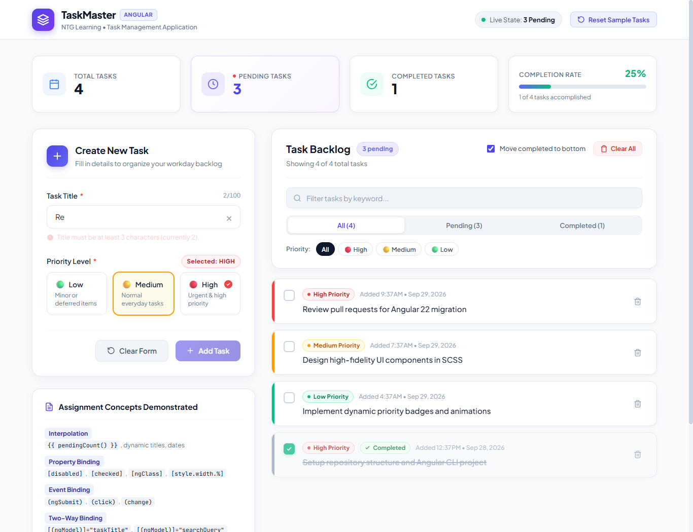
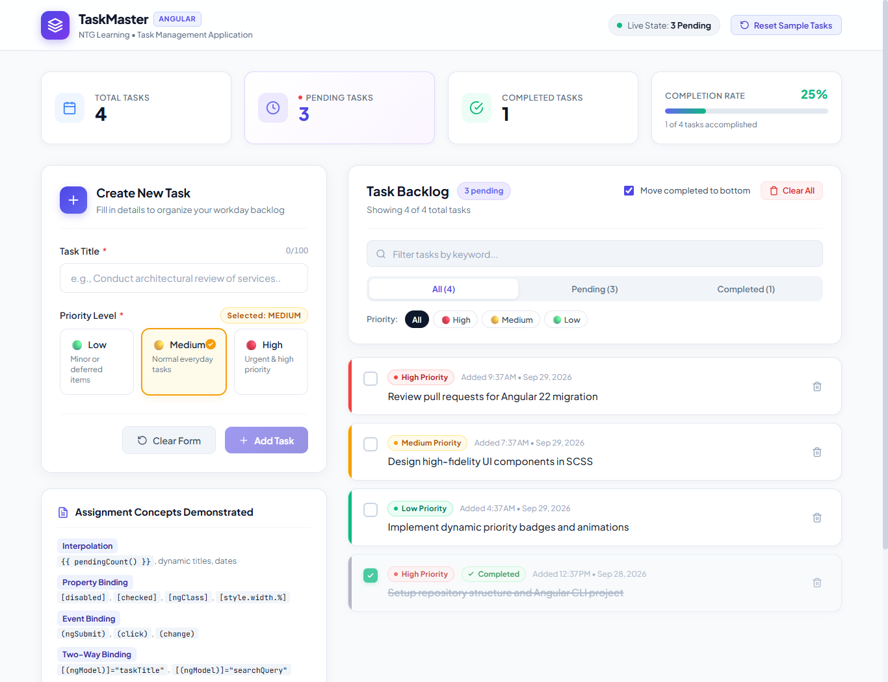
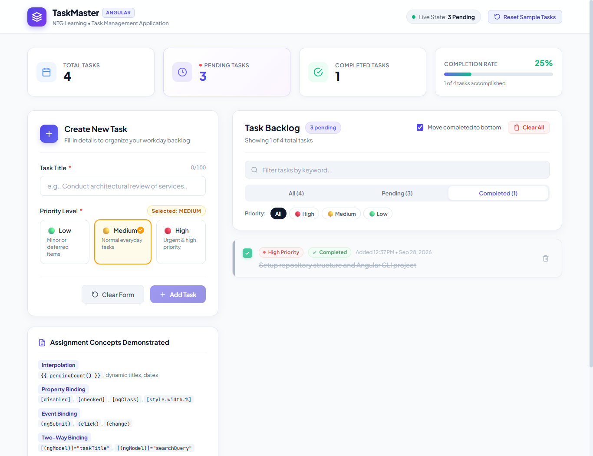
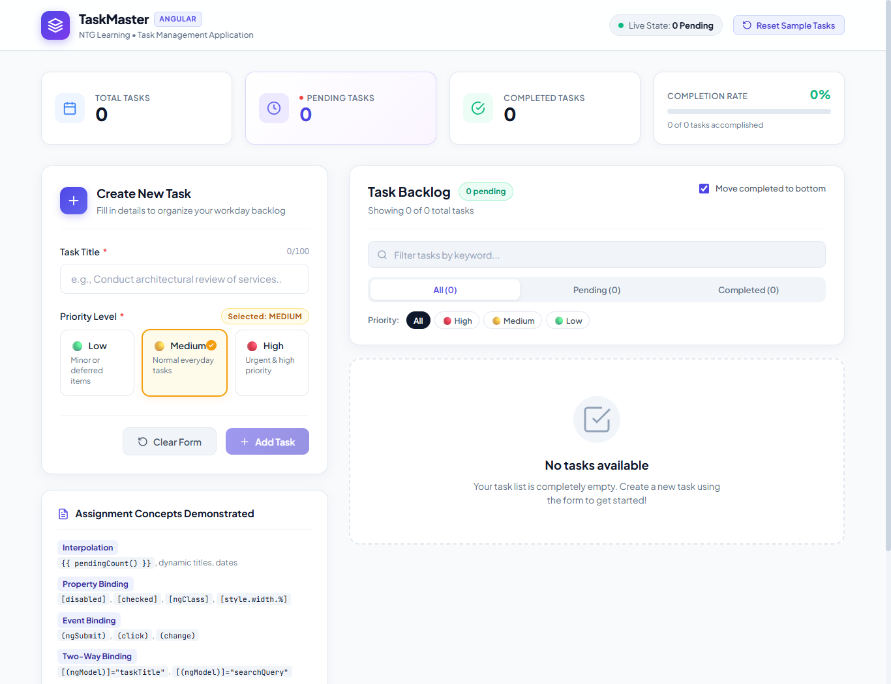

# 📋 TaskMaster &mdash; Angular Task Management Application

> **NTG Learning Angular Assignment**  
> A high-fidelity, production-grade Task Management application built with **Angular (v22)** demonstrating modern frontend architecture, Angular Signals, reactive state management, two-way data binding, template validation, dynamic priority styling, and modern control flow (`@if`, `@for`).

---

## 📸 Screenshots of the Working Application

The application delivers an executive, modern UI/UX crafted with a cohesive design system, micro-interactions, responsive layouts, and accessible contrast.

### 1. Full Application Dashboard Overview
Demonstrating the Executive Metrics Dashboard, Task Creation Form, Backlog List, Priority Badges, Completed Strikethrough & Grayed-out States, and Live Pending Task Count:



---

### 2. Task Form Validation & Interactive Priority Selection
Demonstrating real-time form validation (`required`, `minlength="3"`, `maxlength="100"`), real-time character counter, validation error feedback, clear form button, and segmented priority radio cards:



---

### 3. Dynamic Priority Styling & Completed State Behavior
Demonstrating visual color coding for priorities (**High**: Rose/Red, **Medium**: Amber, **Low**: Emerald/Green), left accent bars, strikethrough styling, grayed-out cards, and automatic **Move Completed to Bottom** reordering:



---

### 4. Status Filtering & Backlog Organization
Demonstrating status filter tabs (`All`, `Pending`, `Completed`), dynamic counts per filter tab, and search filtering:



---

### 5. Empty State Message
Demonstrating the empty state display when all tasks are cleared, including an illustrative SVG graphic and clear call-to-action message:



---

## 🎯 Project Overview & Objective

The objective of this assignment is to construct a resilient, modern **Task Management application using Angular** that showcases senior-level frontend engineering standards:
- Clear component separation of concerns and reactive data flow.
- Form controls with interactive validation states and accessible keyboard navigation.
- Dynamic conditional styling reflecting task priorities and lifecycle states.
- Modern Angular idioms including **Signals**, **Computed Signals**, and the modern **Control Flow Syntax** (`@if`, `@for`, `@empty`).

---

## 🚀 Setup & Run Instructions

### Prerequisites
- **Node.js**: v18.x, v20.x, or v24.x
- **npm**: v9.x or higher
- Modern Web Browser (Chrome, Edge, Firefox, Safari)

### 1. Clone the Repository
```bash
git clone https://github.com/Personal-Repo/NTG-Learning-Task-Management-application-using-Angular.git
cd NTG-Learning-Task-Management-application-using-Angular
```

### 2. Install Dependencies
```bash
npm install
```

### 3. Run the Development Server
```bash
npm start
# or: ng serve
```
Open your browser and navigate to:
```
http://localhost:4200/
```
The application will automatically reload if you change any of the source files.

### 4. Run Unit Tests (Vitest)
All 29 unit tests can be executed with:
```bash
npm test -- --watch=false
```

### 5. Build for Production
```bash
npm run build
```
Production build artifacts will be stored in the `dist/task-manager/` directory.

---

## ✨ Features Implemented

### 1. Task Backlog Management
- **Task Attributes**: Each task maintains a unique `id`, `title`, `priority` (`low` | `medium` | `high`), `completed` boolean status, and `createdAt` timestamp.
- **Add Tasks**: Interactive form to add tasks instantly to the backlog.
- **Toggle Completion**: One-click checkbox/toggle that updates live task status and triggers visual transitions.
- **Delete Tasks**: Individual task removal with hover micro-animations.
- **Clear All**: Option to clear all backlog items with confirmation.
- **Reset to Sample Tasks**: A convenient navbar button allowing evaluators to reset and inspect initial sample tasks at any time.
- **LocalStorage Persistence**: Tasks persist across browser refreshes automatically.

### 2. Priority & Completed State Styling
- **Priority Indicators**:
  - **High Priority**: Red accent border (`#ef4444`), subtle rose badge background, red status dot.
  - **Medium Priority**: Amber accent border (`#f59e0b`), amber badge background, amber status dot.
  - **Low Priority**: Emerald accent border (`#10b981`), emerald badge background, green status dot.
- **Completed Task Transformations**:
  - **Strikethrough**: Title text styled with `text-decoration: line-through`.
  - **Grayed Out**: Card opacity reduced to `0.75` with muted text colors and subdued borders.
  - **Moved to Bottom**: Completed tasks automatically sort below active tasks (toggleable via the "Move completed to bottom" checkbox).
  - **Completed Badge**: Green check pill badge confirming task completion.

### 3. Live Counters & Metrics Dashboard
- **Live Pending Task Count**: Displayed prominently in the top navbar status pill, the backlog section header, and the executive metrics card.
- **Executive Metrics Grid**:
  - **Total Tasks**: Total count of backlog items.
  - **Pending Tasks**: Highlighted counter with a live pulsing indicator.
  - **Completed Tasks**: Real-time count of accomplished items.
  - **Completion Rate**: Dynamic progress bar calculating completion percentage in real time.

### 4. Interactive Filtering & Search
- **Status Filter Tabs**: Filter by `All`, `Pending`, or `Completed` tasks with badge counts.
- **Priority Filter Chips**: One-click filter chips to view only `High`, `Medium`, or `Low` priority items.
- **Live Search**: Instant keyword filtering across task titles with a clear button.

### 5. Form Validation & UX
- **Required Field Validation**: Ensures task title cannot be empty.
- **Length Constraints**: Minimum 3 characters (`minlength="3"`) and maximum 100 characters (`maxlength="100"`).
- **Interactive Error Messages**: Clear visual warnings rendered conditionally when inputs are touched/dirty and invalid.
- **Character Counter**: Real-time `X/100` indicator that turns warning amber at 80+ chars and red at 100 chars.
- **Clear Form Button**: Resets title, priority selection, character counter, and validation states.
- **Button Disabled State**: Add Task button is disabled when the form is invalid or whitespace-only.

### 6. Empty States
- **Backlog Empty State**: Friendly illustration and message when all tasks are cleared.
- **Filter Empty State**: Dedicated empty state when search or filter criteria yield 0 matches, with a "Reset All Filters" button.

---

## 🏗️ Components Created & Architecture

The application is architected cleanly following Angular modularity and single-responsibility principles:

```
src/app/
├── components/
│   ├── task-form/
│   │   ├── task-form.component.ts        # Standalone task creation form component
│   │   ├── task-form.component.html      # Form template with validation feedback
│   │   ├── task-form.component.scss      # Form styling, priority card selectors
│   │   └── task-form.component.spec.ts   # 5 Unit tests for form component
│   │
│   └── task-list/
│       ├── task-list.component.ts        # Standalone task list component
│       ├── task-list.component.html      # List template, filters, search, empty state
│       ├── task-list.component.scss      # Priority styling, completed states
│       └── task-list.component.spec.ts   # 10 Unit tests for list component
│
├── models/
│   └── task.model.ts                     # Task, TaskPriority, TaskFilter interfaces
│
├── services/
│   ├── task.service.ts                   # Angular Signals state service + LocalStorage
│   └── task.service.spec.ts              # 9 Unit tests for service operations
│
├── app.component.ts                      # Root coordinator with metrics signals
├── app.component.html                    # Navbar, metrics grid, layout container
├── app.component.scss                    # Design system, layout grid, metrics cards
├── app.component.spec.ts                 # 5 Unit tests for root component
├── app.config.ts                         # Application configuration
└── main.ts                               # Standalone bootstrap
```

### Component Breakdown
1. **`AppComponent` (`<app-root>`)**:
   - Manages top-level application layout, navigation bar, and live executive metrics.
   - Coordinates events between `TaskFormComponent` and `TaskListComponent`.
   - Injects `TaskService` and exposes reactive signals (`pendingCount`, `completedCount`, `totalCount`, `completionRate`).

2. **`TaskFormComponent` (`<app-task-form>`)**:
   - Encapsulates task input, priority selection, real-time validation, and character counting.
   - Implements two-way data binding `[(ngModel)]` for both title and priority.
   - Emits `@Output() taskAdded` on valid submission.
   - Provides a dedicated "Clear Form" button to reset state.

3. **`TaskListComponent` (`<app-task-list>`)**:
   - Accepts `@Input() tasks` and `@Input() pendingCount`.
   - Features search filtering, status tab filtering, priority chip filtering, and "move completed to bottom" sorting.
   - Renders task cards with dynamic priority borders, priority badges, custom completion checkboxes, strikethrough, and grayed-out styling.
   - Emits `@Output() taskToggled`, `@Output() taskDeleted`, and `@Output() allTasksCleared`.
   - Handles global and filtered empty states.

4. **`TaskService` (`@Injectable({ providedIn: 'root' })`)**:
   - Central reactive store leveraging Angular Signals (`signal`, `computed`).
   - Automatically computes live pending task count, completed count, total count, and completion rate.
   - Persists state changes to browser `localStorage`.

---

## 💡 Angular Concepts Demonstrated

| Angular Concept | Implementation Details | File Location |
| :--- | :--- | :--- |
| **Interpolation `{{ }}`** | Dynamic task title, live pending count, character counter `{{ taskTitle.length }}/100`, completion percentage `{{ completionRate() }}%`, dates with DatePipe `{{ task.createdAt \| date: 'mediumDate' }}` | `app.component.html`, `task-form.component.html`, `task-list.component.html` |
| **Property Binding `[ ]`** | `[disabled]="taskForm.invalid"`, `[checked]="task.completed"`, `[style.width.%]="completionRate()"`, `[ngClass]="getTaskCardClass(task)"`, `[attr.aria-checked]` | `task-form.component.html`, `task-list.component.html`, `app.component.html` |
| **Event Binding `( )`** | `(ngSubmit)="onSubmit(taskForm)"`, `(click)="resetForm(taskForm)"`, `(change)="onToggleTask(task.id)"`, `(click)="onDeleteTask(task.id)"`, `(click)="setPriority(option.value)"` | `task-form.component.html`, `task-list.component.html` |
| **Two-Way Binding `[( )]`** | `[(ngModel)]="taskTitle"`, `[(ngModel)]="selectedPriority"`, `[(ngModel)]="searchQuery"`, `[(ngModel)]="moveCompletedToBottom"` | `task-form.component.html`, `task-list.component.html` |
| **Modern Control Flow `@if`, `@else if`** | Conditional display of validation error messages, clear buttons, checkmark icons, and empty state containers | `task-form.component.html`, `task-list.component.html` |
| **Modern Control Flow `@for`, `@empty`** | Looping through priority options and task backlog with `track task.id`, and displaying empty state cards | `task-form.component.html`, `task-list.component.html` |
| **Conditional Classes & Styling** | Dynamic priority borders (`priority-high`, `priority-medium`, `priority-low`), completed strikethrough (`strikethrough`), grayed-out styling (`task-item--completed`), active tabs (`active`) | `task-list.component.scss`, `task-form.component.scss` |
| **Signals & Computed Signals** | `signal<Task[]>()`, `computed(() => pendingCount)`, `computed(() => completionRate)` for automatic, fine-grained reactivity | `task.service.ts`, `app.component.ts` |
| **Component Input / Output** | Modern `@Input({ required: true })`, `@Output() taskAdded = new EventEmitter()`, `@Output() taskToggled` | `task-form.component.ts`, `task-list.component.ts` |
| **Template Validation** | Angular template-driven form with `required`, `minlength="3"`, `maxlength="100"`, `ngModel` validity checks (`dirty`, `touched`, `invalid`) | `task-form.component.html` |

---

## 🧪 Unit Testing Summary

A comprehensive test suite of **29 unit tests** covering all components, signals, forms, and service methods:

```bash
 RUN  v5.0.2

 ✓  task-manager  src/app/services/task.service.spec.ts (9 tests)
 ✓  task-manager  src/app/components/task-form/task-form.component.spec.ts (5 tests)
 ✓  task-manager  src/app/components/task-list/task-list.component.spec.ts (10 tests)
 ✓  task-manager  src/app/app.component.spec.ts (5 tests)

 Test Files  4 passed (4)
      Tests  29 passed (29)
   Duration  1.78s
```

---
