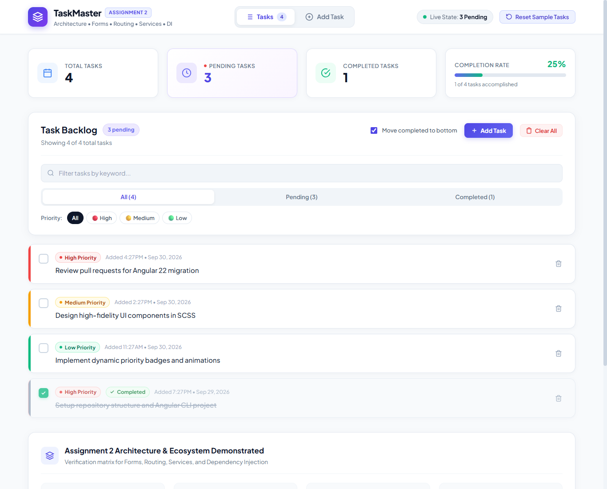
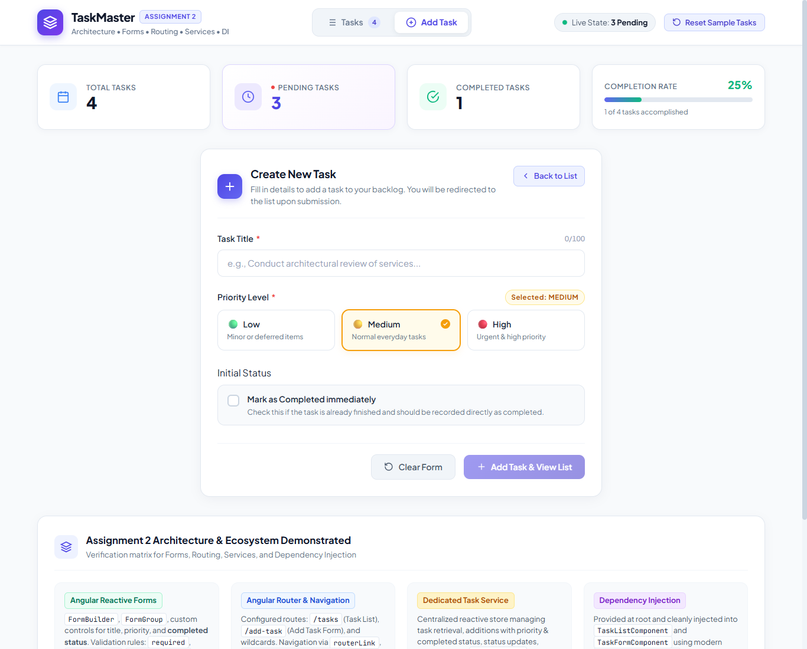
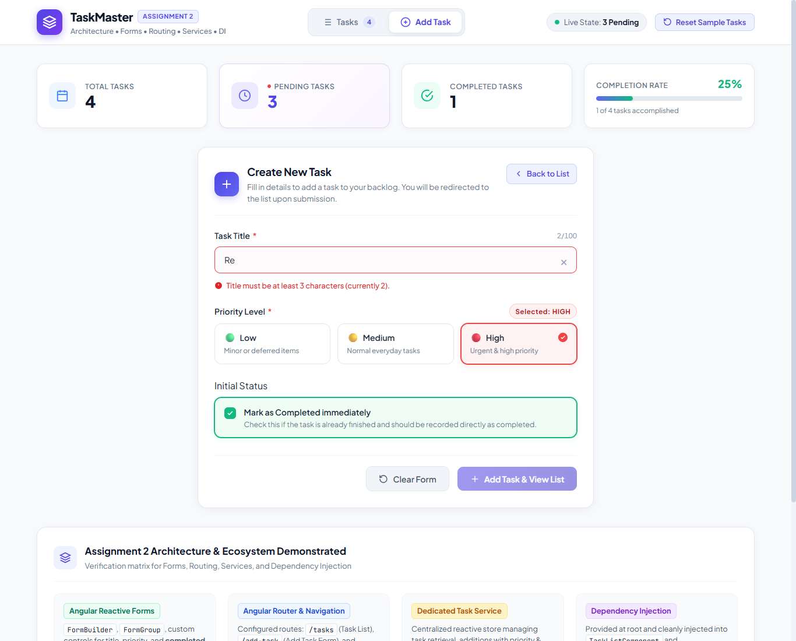
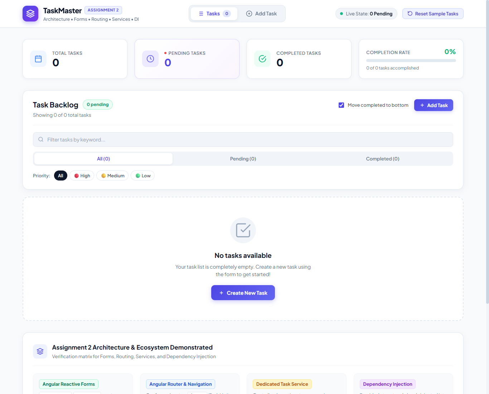

# 📋 TaskMaster &mdash; Angular Task Management Application

> **NTG Learning Angular Assignment 2: Angular Architecture & Ecosystem**  
> An enhanced, enterprise-grade Task Management application built with **Angular (v22)** demonstrating advanced Angular architecture: **Reactive Forms**, **Angular Router**, **Dedicated Services**, and **Dependency Injection (DI)**, while retaining all core backlog management, priority categorization, and dynamic styling features.

---

## 📸 Screenshots of the Working Application (Assignment 2)

The application features a modern SaaS interface built with an executive metrics dashboard, responsive navbar navigation, and distinct routed views.

### 1. Routed Task List View (`/tasks`)
Demonstrates the active `Tasks` navigation tab, live pending task counter badge, executive metrics, task backlog with priority accent strips, completed items moved to the bottom with strikethrough styling, and a direct `+ Add Task` router link button:



---

### 2. Dedicated Add Task Form View (`/add-task`)
Demonstrates the routed `/add-task` view with active navbar tab, reactive form controls, segmented priority selectors, **Initial Completed Status** toggle, Clear Form button, and a **Back to List** router navigation link:



---

### 3. Reactive Form Validation & Initial Completed Status
Demonstrates real-time form validation (`required`, `minlength="3"`, `maxlength="100"`), live character counter (`2/100`), error feedback, active High Priority pill, the **Mark as Completed immediately** toggle card, and disabled submit button:



---

### 4. Backlog Empty State with Router Action
Demonstrates the global empty state when backlog is cleared, with zero-state metric pills and a `+ Create New Task` button routing directly to `/add-task`:



---

## 🎯 Assignment 2 Objectives & Requirements

This phase enhances the application by restructuring it into multiple routed views and decoupling data management through Angular services and Dependency Injection:

1. **Angular Forms**:
   - Implemented using **Angular Reactive Forms** (`FormBuilder`, `FormGroup`, `Validators`).
   - Accepts task **title**, selectable **priority** (Low / Medium / High), and **completed status** (`completed: boolean`).
   - Real-time validation alerts, character counter, and disabled submit states.
   - **Clear Form** button resets inputs and touched/dirty states.
   - Resets the form upon submission and automatically navigates back to `/tasks`.

2. **Angular Routing**:
   - Configured separate routes:
     - `/tasks` &rarr; `TaskListComponent`
     - `/add-task` &rarr; `TaskFormComponent`
     - `''` &rarr; Redirects to `/tasks`
     - `'**'` &rarr; Wildcard redirect to `/tasks`
   - Top-level router navigation (`Tasks | Add Task`) with `routerLinkActive="active"`.
   - Programmatic navigation via `this.router.navigate(['/tasks'])` upon successfully adding a task.

3. **Dedicated Task Service & Dependency Injection**:
   - `TaskService` (`@Injectable({ providedIn: 'root' })`) acts as the single source of truth.
   - Injected directly into `TaskListComponent` and `TaskFormComponent` using Angular's modern `inject(TaskService)` DI mechanism.
   - Responsible for maintaining tasks, retrieving tasks, adding tasks with priority & status, updating completed status, and persistent storage via `localStorage`.

---

## 🚀 Setup & Run Instructions

### Prerequisites
- **Node.js**: v18.x, v20.x, or v24.x
- **npm**: v9.x or higher
- Modern Web Browser (Chrome, Edge, Firefox, Safari)

### 1. Clone the Repository
```bash
git clone https://github.com/Personal-Repo/NTG-Learning-Task-Management-application-using-Angular.git
cd NTG-Learning-Task-Management-application-using-Angular
```

### 2. Install Dependencies
```bash
npm install
```

### 3. Run the Development Server
```bash
npm start
# or: ng serve
```
Open your browser and navigate to:
```
http://localhost:4200/
```
The application will automatically load and route to `/tasks`.

### 4. Run Unit Tests (Vitest)
All 35 unit tests can be executed with:
```bash
npm test -- --watch=false
```

### 5. Build for Production
```bash
npm run build
```
Production build artifacts will be stored in the `dist/task-manager/` directory.

---

## 🏗️ Architecture & Component Hierarchy

```
src/app/
├── components/
│   ├── task-form/
│   │   ├── task-form.component.ts        # Reactive Form + DI (TaskService, Router)
│   │   ├── task-form.component.html      # Form template with validation & status toggle
│   │   ├── task-form.component.scss      # Responsive SaaS form styling
│   │   └── task-form.component.spec.ts   # 8 Unit tests (validation, DI, navigation)
│   │
│   └── task-list/
│       ├── task-list.component.ts        # Injects TaskService via DI, filters & search
│       ├── task-list.component.html      # Backlog items, router links, empty state
│       ├── task-list.component.scss      # Priority styling, completed states
│       └── task-list.component.spec.ts   # 11 Unit tests (DI, filtering, routerLink)
│
├── models/
│   └── task.model.ts                     # Task, TaskPriority, TaskFilter interfaces
│
├── services/
│   ├── task.service.ts                   # Angular Signals state service + LocalStorage
│   └── task.service.spec.ts              # 11 Unit tests for service operations
│
├── app.component.ts                      # Shell coordinator with router navigation
├── app.component.html                    # Navbar with router links, metrics, router-outlet
├── app.component.scss                    # Navbar, active tab styling, design tokens
├── app.component.spec.ts                 # 5 Unit tests for router-outlet and navbar
├── app.routes.ts                         # Route definitions (/tasks, /add-task)
├── app.config.ts                         # provideRouter and application configuration
└── main.ts                               # Standalone bootstrap
```

### Dependency Injection Flow
```
               ┌──────────────────────────┐
               │       TaskService        │
               │  (Signals & LocalStorage)│
               └─────────────┬────────────┘
                             │
            ┌────────────────┴────────────────┐
            ▼                                 ▼
┌───────────────────────┐         ┌───────────────────────┐
│   TaskListComponent   │         │   TaskFormComponent   │
│  (inject TaskService) │         │  (inject TaskService, │
│  Route: /tasks        │         │   inject Router)      │
│                       │         │  Route: /add-task     │
└───────────────────────┘         └───────────────────────┘
```

---

## 💡 Assignment 2 Core Concepts Demonstrated

| Core Requirement | Implementation Details | File Location |
| :--- | :--- | :--- |
| **Angular Reactive Forms** | `FormBuilder.group({ title, priority, completed })`, with `Validators.required`, `Validators.minLength(3)`, `Validators.maxLength(100)` | `task-form.component.ts`, `task-form.component.html` |
| **Initial Completed Status** | Form includes a dedicated `completed` control allowing tasks to be added directly as completed upon creation | `task-form.component.html`, `task-form.component.ts` |
| **Form Reset & Clear** | Dedicated `resetForm()` resets form controls to initial defaults and clears touched/dirty flags | `task-form.component.ts`, `task-form.component.html` |
| **Angular Routing** | Configured routes for `/tasks` and `/add-task` with redirect and wildcard handling | `app.routes.ts`, `app.config.ts` |
| **Navbar Router Links** | Navigation between views (`Tasks \| Add Task`) using `routerLink` and `routerLinkActive="active"` | `app.component.html`, `app.component.scss` |
| **Programmatic Navigation** | Upon valid form submission, `this.router.navigate(['/tasks'])` redirects to the task list | `task-form.component.ts` |
| **Dedicated Task Service** | `TaskService` maintains state via Angular Signals (`signal`, `computed`) and persists to `localStorage` | `task.service.ts` |
| **Dependency Injection (DI)** | Components inject `TaskService` using modern `inject(TaskService)` instead of managing independent state | `task-list.component.ts`, `task-form.component.ts` |
| **Priority & Completed Styling** | High (Red), Medium (Amber), Low (Green) border strips and badges; strikethrough and grayed-out cards | `task-list.component.scss` |
| **Live Pending Task Count** | `computed(() => pendingCount)` updates live counter in navbar pill, header badge, and metrics card | `task.service.ts`, `app.component.ts` |

---

## 🧪 Unit Testing Suite (Vitest)

A total of **35 unit tests** verify all Assignment 2 requirements:

```bash
 RUN  v5.0.2

 ✓  task-manager  src/app/services/task.service.spec.ts (11 tests)
 ✓  task-manager  src/app/app.component.spec.ts (5 tests)
 ✓  task-manager  src/app/components/task-form/task-form.component.spec.ts (8 tests)
 ✓  task-manager  src/app/components/task-list/task-list.component.spec.ts (11 tests)

 Test Files  4 passed (4)
      Tests  35 passed (35)
   Duration  2.07s
```

---

## 📊 Assignment 2 Compliance Matrix

| Assignment 2 Requirement | Compliance Summary | Status |
| :--- | :--- | :---: |
| **Separate Components** | `TaskListComponent` (`/tasks`) and `TaskFormComponent` (`/add-task`) | ✅ Pass |
| **Task Management** | Title, Priority (Low/Med/High), and Completed Status with CRUD lifecycle | ✅ Pass |
| **Existing Features Retained** | Empty state, priority styling, completed strikethrough, live pending count | ✅ Pass |
| **Angular Forms** | Reactive Forms with title, priority, **completed status**, validation, and Clear Form button | ✅ Pass |
| **Angular Routing** | Dedicated routes `/tasks` and `/add-task` with seamless view navigation | ✅ Pass |
| **Post-Submission Redirect** | Successfully adding a task navigates back to `/tasks` via Router | ✅ Pass |
| **Dedicated Task Service** | `TaskService` maintains, retrieves, adds, and updates task status with Signals | ✅ Pass |
| **Dependency Injection** | `TaskListComponent` and `TaskFormComponent` use injected `TaskService` | ✅ Pass |
| **Navigation Bar** | Router links for `Tasks \| Add Task` with active tab indicators | ✅ Pass |
| **README & Evidence** | Comprehensive documentation and 4 high-resolution evidence screenshots | ✅ Pass |

---

## 👤 Submission Details
- **Assignment**: Angular Task Manager - Assignment 2 (Angular Architecture & Ecosystem)
- **Repository Collaborator**: `arjunpandt` (to be added via GitHub repository settings)
- **Built with**: Angular 22 &bull; TypeScript &bull; Reactive Forms &bull; Angular Router &bull; Signals &bull; SCSS &bull; Vitest
